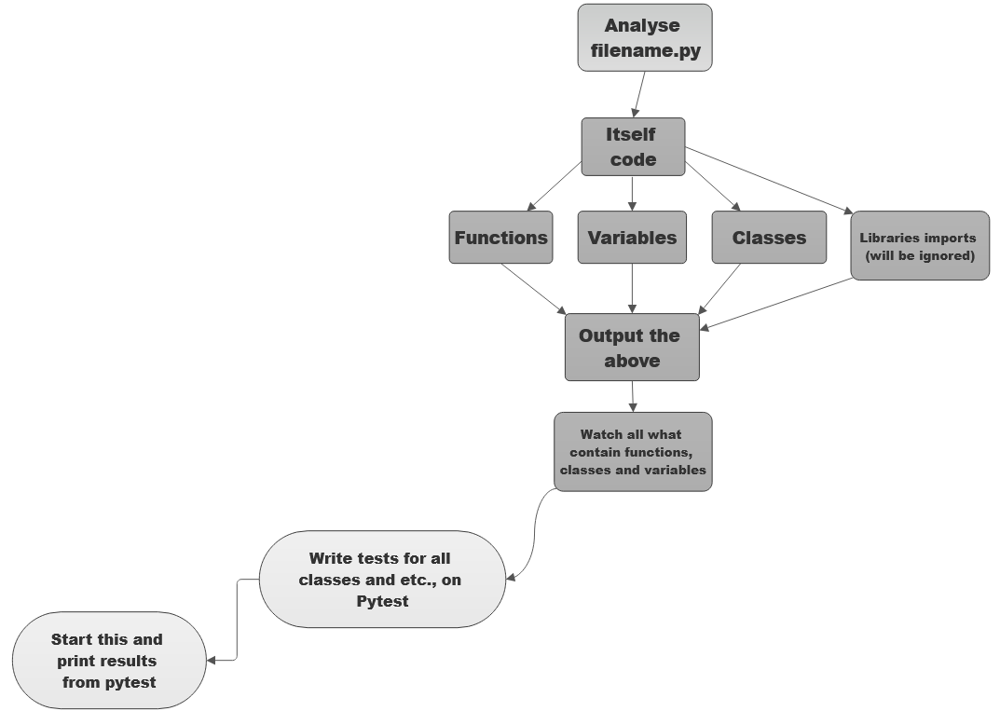

1. - [x] Write code detection
2. - [ ] Write code analysis
3. - [ ] Write algorithm for fully automatic tests
4. - [ ] Write automatic tests for  fully automatic tests (wtf, too confusing a sentence xD)

### Image of scheme 
Here is how i see future project (that`s not all, i will write this block-scheme in future):  

