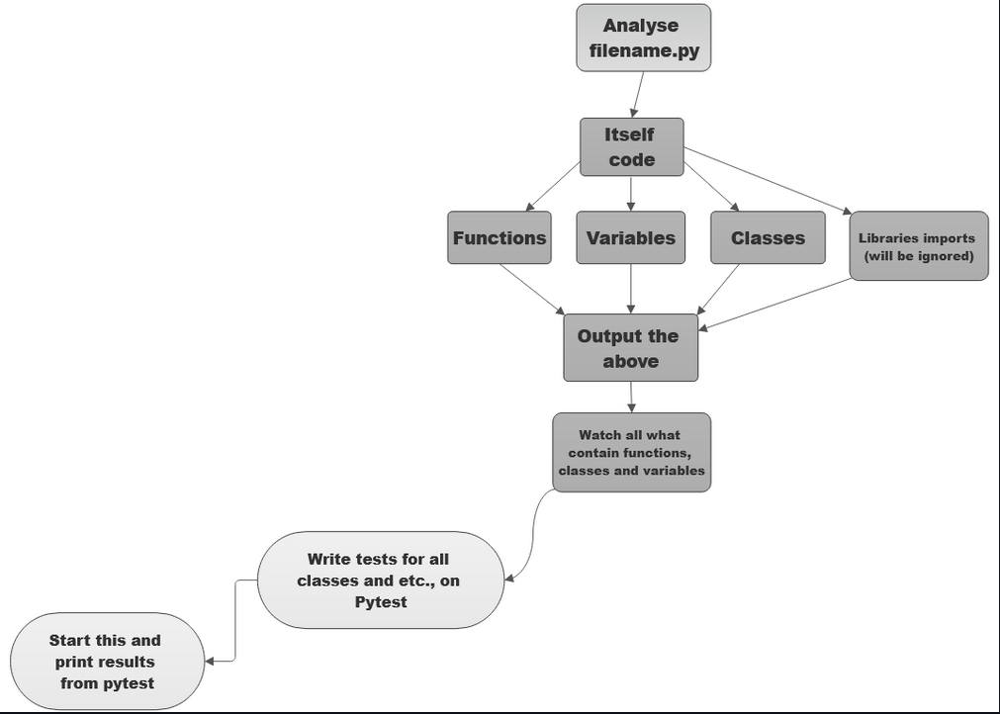

1. - [x] Write code detection
2. - [x] Write code analysis
3. - [x] Write algorithm for fully automatic tests (In process, but almost work)
4. - [ ] Write automatic tests for  fully automatic tests (wtf, too confusing a sentence xD)

## Block Scheme
Wanna watch block-scheme of project? You`re welcome!

